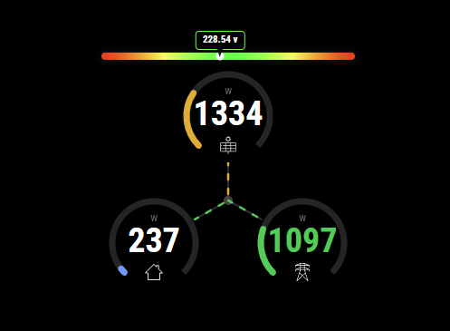

# Shelly-EM Meter

## Description
This is a simple MagicMirror² module to display data from a Shelly EM sensor on MagicMirror² and is inspired by the project [Shelly-PM](https://github.com/stefanjacobs/MMM-Shelly-PM).

The Shelly EM is a Wi-Fi current and voltage meter that allows you to monitor the consumption of any household appliance, electrical circuit and office equipment. 

I use it for monitoring my photovoltaic system.

Feel free to extend to fulfill your own needs, this fulfills my needs. See the configuration and some pictures [here](#Configuration).

The module uses the Shelly EM API over LAN to get the sensor data. For details, [check here](https://shelly-api-docs.shelly.cloud/).
For it to work properly, it's best to have a static IP for your Shelly. Since it's using LAN connection, no authentication is needed towards the API.

#### How to find Shelly IP on a router

- Make sure you have access rights to your router.
- Enter 192.168.1.1 (usually it is) in the address bar of any web browser.
- Type your router username and password.
- Find the DHCP client table or client list.
- Open the client list or DHCP client table.
- Click on the device to reveal its IP address.


## Prerequisites

- You need to have a MagicMirror² up and running, also a [Shelly EM sensor](https://shelly.cloud/) with a fixed IP.
- The default 'clock' module must be active because the 'ShellyEMMeter' module uses the events fired by 'clock' to call Shelly on the lan. In addition, in the configuration of the 'clock' module, **sendNotifications: true** must be set.


## Configuration

Include this in your config.js file:

```js
{
    module: "MMM-ShellyEMMeter",
    position: "top_right",
    header: "Shelly EM Meter",
    config: {
        refreshInterval: 15,                          // in seconds
        localuri: "http://192.168.1.185/status",      // Shelly EM LAN address
        voltageScale: {
            nominal: 230,           // nominal voltage (V)
            tolerancePercent: 10,   // gauge range ±10% around nominal
            // optional manual override:
            //min: 207,             // V
            //max: 253,             // V
        },
        maxProduction: 1500,        // photovoltaic peak power (W) – sets gauge scale
        maxGrid:       3300        // max grid power (W) – sets gauge scale
    }
},
```

### Configuration options

| Option | Default      | Description |
|---|--------------|---|
| `refreshInterval` | `15`         | How often to poll the Shelly EM, in seconds. |
| `localuri` | *(required)* | Full URL of the Shelly EM `/status` endpoint on your LAN. |
| `voltageScale.nominal` | `230`        | Nominal mains voltage (V). Used to centre the voltage gauge. |
| `voltageScale.tolerancePercent` | `10`         | Percentage band around nominal shown on the voltage bar (e.g. `10` → 207–253 V). |
| `voltageScale.min` / `.max` | —            | Optional hard override of the voltage bar range (V). When set, `nominal` and `tolerancePercent` are ignored. |
| `maxProduction` | `1500`       | Peak photovoltaic power (W). Sets the full-scale of the **Production** gauge arc. |
| `maxGrid` | `3300`       | Maximum grid power (W). Sets the full-scale of the **Grid** gauge arc. |

## Visual features

The module renders a triangle layout with three circular gauges (Production, Consumption, Grid) connected by animated flow lines.

## Screenshot



## Installing

Go to your MagicMirror directory

```bash
cd mounts/modules
git clone https://github.com/mgarrix/MMM-ShellyEMMeter

```

Check out the `config.sample.js` in the module directory. Copy the content to your `config.js` and change as necessary. You have to change `localuri` to your device's IP address and `refreshInterval` to set the refresh interval (in seconds).


Restart MagicMirror and enjoy.
